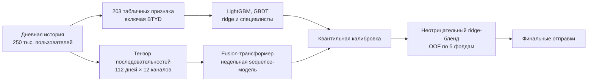

# Ozon Tech E-CUP 2026 — прогноз GMV пользователей

> **9 место из 678 команд.** Прогноз GMV 250 000 пользователей на 30 дней: ансамбль из 14 моделей, выбранный из 539 измеренных кандидатов. Финальный RMSLE — **1.6624** при 1.6602 у победителя.


## Результат

| Метрика | Наш результат | Победитель | Выборка |
|---|---:|---:|---|
| RMSLE | **1.6624** | 1.6602 | финальный приватный лидерборд |
| RMSLE | 1.6456 / 1.6457 | — | две выбранные публичные отправки |

В команде из пяти человек я отвечал за ансамбль и отправки: разработал **12 из 14 моделей финального бленда — 72% его веса**, а также протокол валидации, калибровку и подбор весов.

## Схема решения



## Постановка

Предсказание суммарного GMV каждого из 250 000 пользователей за окно 14.02–15.03.2026
по дневным логам активности (поиск, каталог, корзины, заказы; товаров и категорий в
данных нет). Метрика — RMSLE: RMSE между `log1p(факт)` и `log1p(прогноз)`.

Репозиторий приведён к одному назначению: **воспроизвести два файла, выбранные
финальными** — `F14_int08` и `F21_seg4g08`. Всё, что не участвует в их сборке,
из него убрано.

## Что где лежит

```
final_submission/     пакет сдачи: инференс, обученные артефакты, поправки
├── README.md                устройство решения: данные, признаки, валидация, состав бленда
├── reproduce_training.md    команды воспроизведения каждого шага обучения
├── inference.py             оркестратор: признаки -> модели -> ансамбль -> поправки -> csv
├── run_inference.sh         полный инференс одной командой
├── assemble_finals.py       база + замороженные поправки -> два финальных файла
├── requirements.txt         зафиксированные версии (Python 3.10.17)
├── models/                  обученные артефакты и замороженные измеренные векторы
└── deltas/                  поправки кандидатов + манифест со сверкой значений и sha256
work/scripts/         код признаков, трейнеров и конвейера сборки
work/colab/           GPU-рука секвенсной модели (два члена бленда)
work_kostya/          пайплайн модели сегмента непокупателей (крупнейший член бленда)
work/preds_pack/      валидационная матрица прогнозов — эталон 1.665647 для приёмки
submissions/          F14_int08.csv и F21_seg4g08.csv — отправленные файлы
```

## Как воспроизвести

```bash
python3.10 -m venv .venv && .venv/bin/pip install -r final_submission/requirements.txt
# train.parquet и sample_submit.csv положить в корень репозитория (или задать OZON_ROOT)

.venv/bin/python final_submission/inference.py --stage check   # что есть, чего не хватает
bash final_submission/run_inference.sh                          # -> FILE.csv (база)
.venv/bin/python final_submission/assemble_finals.py --base FILE.csv --out-dir submissions
```

Последняя команда собирает `F12_ebint` (общий родитель), затем `F14_int08` и
`F21_seg4g08`, и сверяет каждый файл с манифестом — по значениям и по sha256.

От проверяющего нужны только `train.parquet` и `sample_submit.csv`: все восемнадцать
базовых прогнозов состава уже в репозитории — шесть считаются из сохранённых весов
(`final_submission/models/`), двенадцать приезжают готовыми прогноз-артефактами
(`final_submission/models/preds_test/`). Признаки, тензор seq3 и модель молчания
инференс собирает сам.

`--stage check` печатает по каждому артефакту, есть он или нет и какой командой
получается, ДО того как будет потрачено время на счёт. Из чистого клона без
`train.parquet` он честно покажет, чего не хватает, и остановится.

Полное описание решения — `final_submission/README.md`; команды обучения каждого
члена бленда — `final_submission/reproduce_training.md`.

## Команда и мой вклад

Команда из пяти человек — *Lastonogie*. **Мой вклад:** ансамбль полного цикла — наборы признаков и тензоры последовательностей, протокол валидации, калибровка, блендер, измерения на лидерборде и все финальные отправки; 12 из 14 моделей итогового ансамбля.

## Свойства решения

- **Только данные соревнования.** Все признаки и модели построены исключительно из
  `train.parquet` и `sample_submit.csv`. Внешних источников и предобученных моделей нет.
- **Без сети.** Ни обучение, ни инференс не выполняют сетевых вызовов; зависимости
  ставятся один раз из `requirements.txt` (все лицензии пермиссивные, copyleft нет).
- **Фиксированные версии и сиды.** Точные версии в `requirements.txt`, сиды — в
  командах обучения.
- **Измеренная, а не обещанная воспроизводимость.** Побитовое повторение отгруженного
  файла не обещается: часть членов — нейросети. Проверяемое утверждение другое — код в
  репозитории порождает модели решения, а расхождение переобучения измерено; таблица —
  в `final_submission/README.md`, раздел 7.

Референсное железо разработки: Apple M1 Pro, 10 ядер, 16 GB RAM.
